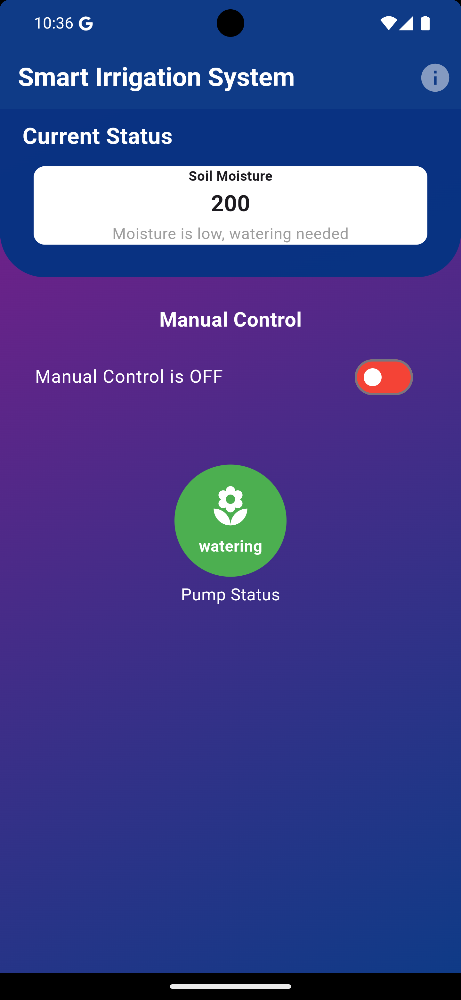
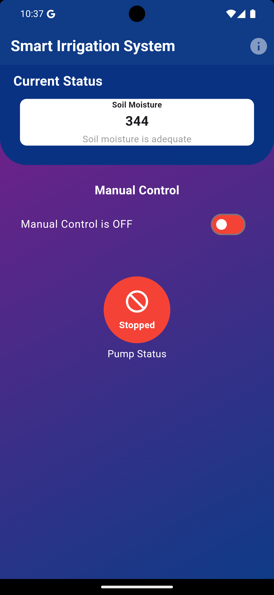
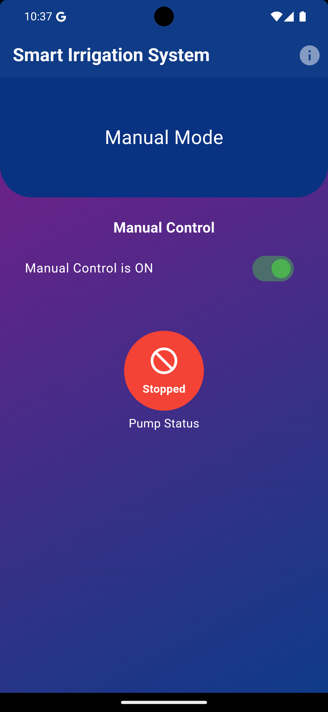
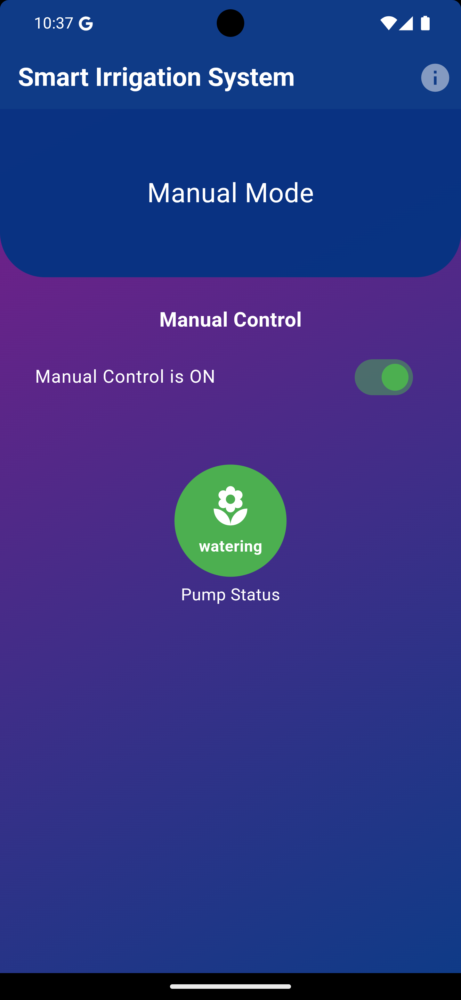
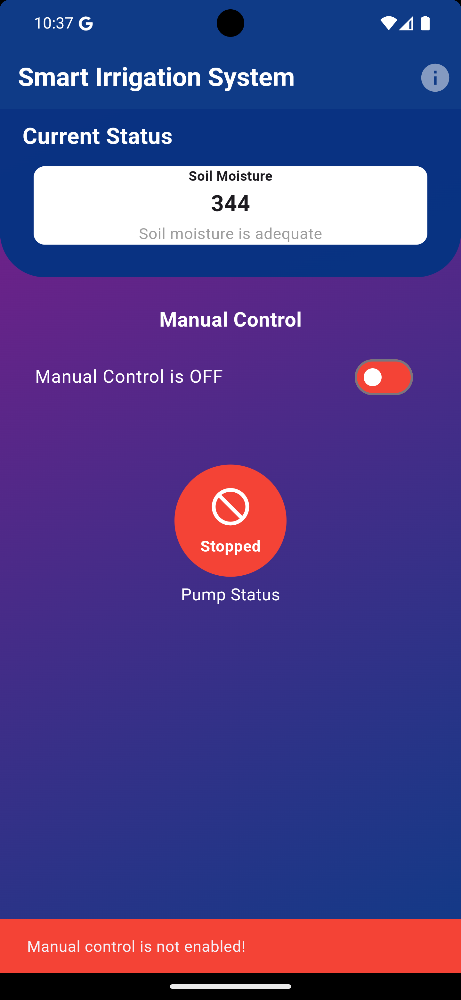

Smart Irrigation System
=======================

This project aims to automate crop irrigation using IoT-based technology. The system measures soil moisture levels and controls water pumps automatically or manually via an Android app. Designed with affordability and ease of installation in mind, it provides a scalable solution for farmers.

Features
--------

-   Automatically controls water pumps based on soil moisture.
-   Allows manual pump control via a user-friendly Android app.
-   Sends real-time updates to the cloud for monitoring.
-   Helps optimize water consumption for sustainable farming.

* * * * *

Project Architecture
--------------------

1.  **Hardware**:

    -   ESP32 microcontroller.
    -   Soil moisture sensor.
    -   Relay module for pump control.
    -   Power supply and wiring.
2.  **Software**:

    -   Flutter-based Android app.
    -   Cloud-based real-time database.

* * * * *

Screenshots
-----------

   
    
     
      
       
   

* * * * *

How to Clone and Run the Flutter App
------------------------------------

### Prerequisites

1.  Install Flutter on your system.
2.  Install Android Studio or any preferred IDE for Flutter.
3.  Ensure you have a physical Android device or emulator.

### Steps

1.  Clone the repository:

    bash

    Copy code

    `git clone https://github.com/shashank77665/Smart-Irrigation-System.git`
    

2.  Navigate to the Flutter app directory:

    bash

    Copy code

    `cd sSmart-Irrigation-System`

3.  Install dependencies:

    bash

    Copy code

    `flutter pub get`

4.  Connect an Android device or start an emulator.
5.  Run the app:

    bash

    Copy code

    `flutter run`

* * * * *

Future Scope
------------

-   Integrate predictive analytics for crop management.
-   Expand sensor compatibility for other environmental data.
-   Enable multi-user support for large-scale farms.